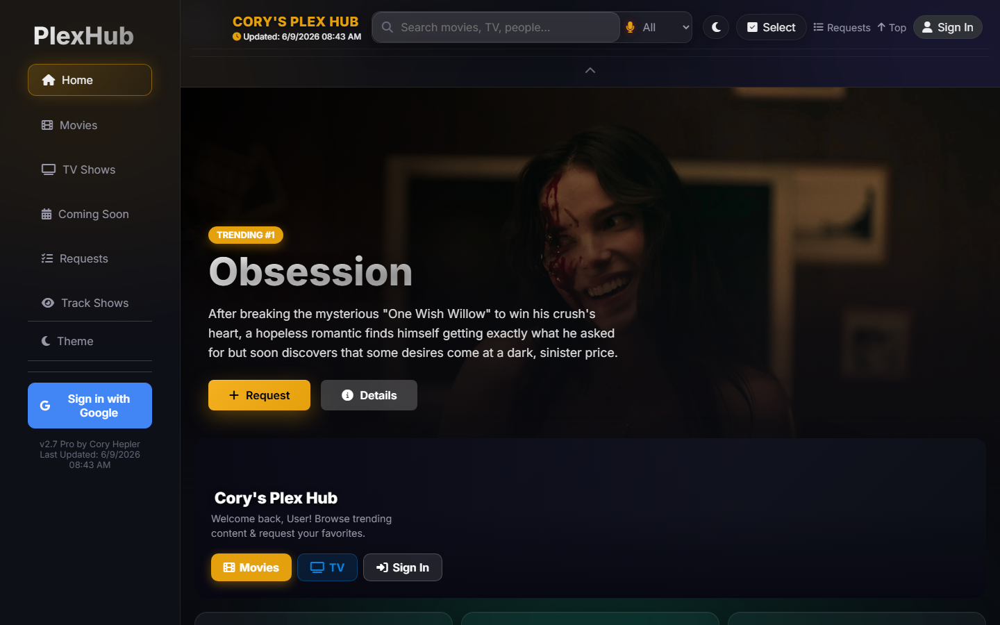

# Cory's Plex Hub

A dark, glassmorphism **Plex request & discovery app** — browse trending movies and TV, request titles for the Plex server, and track new episodes. Installable as a PWA, mobile-friendly, with Google sign-in.

🔗 **Live:** [plex-updates.vercel.app](https://plex-updates.vercel.app)

## Features

- 🎬 Browse trending movies & TV powered by the **TMDB API**
- ✅ Request titles and track request status
- 🔐 **Google sign-in** to save your requests and watchlist
- 📺 Episode tracking for new releases
- 🌗 Dark glassmorphism UI with a light-theme toggle
- 📱 Installable **PWA** with offline support (service worker)

## Tech

HTML5 · JavaScript · TMDB API · Firebase/Google Auth · Service Workers (PWA)
